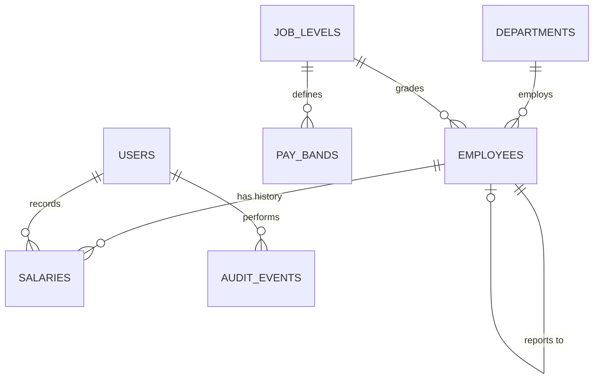

# Architecture

## Shape

A Rails 8.1 API-only application backed by SQLite, serving a React 19 SPA that
is built by Vite into `api/public/`. One process, one deployment, one URL. In
development the two run separately with Vite proxying `/api` to Rails.

```
Browser ──> Rails (Puma)
              ├── GET /            → api/public/index.html  (React bundle)
              └── /api/v1/*        → controllers → queries/services → SQLite
```

## Schema



### employees
`employee_code` (unique), `first_name`, `last_name`, `email` (unique),
`country_code`, `department_id`, `job_level_id`, `manager_id`,
`employment_type` (full_time / part_time / contract), `hired_on`,
`terminated_on`, `status` (active / terminated), `current_salary_id`.

Indexes on `department_id`, `job_level_id`, `country_code`, `status`, and a
composite on `(status, department_id)` for the dominant filter.

### salaries
`employee_id`, `amount_cents` (bigint), `currency`, `effective_from` (date),
`effective_to` (date, nullable), `change_reason`, `recorded_by_id`.

Unique index on `(employee_id, effective_from)`. Index on
`(employee_id, effective_from DESC)`.

Append-only. `effective_to` on the previous row is closed when a new row is
inserted, inside the same transaction. That is the only UPDATE ever performed
on this table.

### pay_bands
`job_level_id`, `country_code`, `min_cents`, `mid_cents`, `max_cents`,
`currency`. Unique on `(job_level_id, country_code)`.

### exchange_rates
`base_currency`, `quote_currency`, `rate_ppm` (integer, rate × 1,000,000),
`rate_on` (date). Unique on `(base_currency, quote_currency, rate_on)`.

### job_levels
`name` (L1…L6), `rank` (integer, for ordering).

### departments
`name`, `cost_centre`.

### users
Generated by `bin/rails generate authentication`. One seeded HR manager.

### audit_events
`actor_id`, `subject_type`, `subject_id`, `action`, `metadata` (JSON string),
`created_at`. Written on every salary change and every employee mutation.

## Currency normalisation

All cross-country comparison normalises to USD at a **single snapshot date**,
`Rates::SNAPSHOT_DATE`, not at each salary's own effective date.

This is deliberate. If each month's payroll were converted at that month's rate,
the trend chart would mix two different signals: compensation decisions and
currency movement. An HR manager looking at "payroll grew 6% this year" needs
that to mean the organisation decided to pay more, not that the dollar moved.
Holding FX constant isolates the decision. The table stores `rate_on` so
as-of-date conversion can be added later without a migration.

Conversion is integer arithmetic:

```ruby
base_cents = (amount_cents * rate_ppm).fdiv(1_000_000).round
```

## Percentiles without `percentile_cont`

SQLite has no ordered-set aggregates. Rather than emulate them with window
functions, the distribution endpoints run one query that plucks
`[group_key, amount_base_cents]` for the filtered population, then compute
statistics in Ruby.

```ruby
Stats::Distribution.new(amounts) # => count, sum, mean, min, p25, p50, p75, max
```

Percentiles use linear interpolation between order statistics, matching
`percentile_cont` semantics, so the numbers stay correct if the database is
swapped later.

The cost is a single query returning ~10,000 integer pairs, roughly 5ms to
fetch and under 10ms to fold. The benefit is that `Stats::Distribution` is a
pure function over an array with no database dependency, so it can be unit
tested against hand-computed values in microseconds.

This approach breaks down somewhere around 500k rows, at which point the answer
is a nightly rollup table rather than a cleverer query. That threshold is 50×
the stated requirement.

## Payroll trend

Reconstructing 24 months of payroll needs, for each month end, each employee's
salary effective at that date. Pluck
`(employee_id, effective_from, amount_base_cents)` ordered by employee and date
once, then fold across the 24 month boundaries in Ruby. One query, ~40k rows,
and the folding logic is a pure function that can be tested on a five-row
fixture.

## API surface

All routes under `/api/v1`. JSON only. Session cookie auth.

| Method | Path | Notes |
|---|---|---|
| POST | `/session` | email + password, sets session |
| DELETE | `/session` | |
| GET | `/me` | current user |
| GET | `/employees` | `q`, `department_id`, `country_code`, `job_level_id`, `status`, `sort`, `page`, `per_page` |
| GET | `/employees/:id` | includes salary history |
| POST | `/employees` | |
| PATCH | `/employees/:id` | |
| POST | `/employees/:id/salaries` | `amount_cents`, `currency`, `effective_from`, `change_reason` |
| GET | `/analytics/overview` | headcount, total payroll, averages, top-line splits |
| GET | `/analytics/distribution` | `group_by=department\|country\|job_level` |
| GET | `/analytics/payroll_trend` | `months` (default 24) |
| GET | `/analytics/outliers` | below band, above band, stale raises |
| GET | `/reference` | departments, levels, countries, currencies — one call to populate every filter |
| GET | `/employees.csv` | export of the current filter |

Errors are a consistent envelope: `{ "error": { "code": ..., "message": ..., "details": {...} } }`.

## Module layout

```
api/app/
├── controllers/api/v1/
│   ├── employees_controller.rb
│   ├── salaries_controller.rb
│   ├── analytics_controller.rb
│   ├── reference_controller.rb
│   └── sessions_controller.rb
├── models/
├── queries/
│   ├── employee_search.rb          # filter + sort allow-list + pagination
│   ├── compensation_snapshot.rb    # current salaries, normalised, filtered
│   ├── payroll_timeline.rb
│   └── band_outliers.rb
├── services/
│   └── salaries/record_change.rb   # the only write path into salaries
├── lib/stats/
│   ├── distribution.rb
│   └── percentile.rb
└── serializers/
```

## Sort allow-list

```ruby
SORTABLE = {
  "name"       => "employees.last_name",
  "hired_on"   => "employees.hired_on",
  "salary"     => "salaries.amount_cents",
  "department" => "departments.name",
  "level"      => "job_levels.rank"
}.freeze
```

Anything not a key in that hash returns 400. Direction is validated separately
against `%w[asc desc]`. Rails quotes values, not identifiers, so this mapping is
the only thing standing between the sort parameter and arbitrary SQL.

## Performance

At 10,000 employees and roughly 40,000 salary rows this is a small dataset. The
decisions that matter are about not making it artificially expensive.

- `employees.current_salary_id` is denormalised and maintained inside the same
  transaction as the salary insert. Turns "current pay for everyone" into a
  single join instead of a correlated subquery per row.
- Every aggregation is a single query. No endpoint instantiates more than one
  page of ActiveRecord objects.
- Directory endpoint uses `includes(:department, :job_level, :current_salary)`
  so a 50-row page is 4 queries, not 200.
- Analytics responses are cached under a key derived from
  `Salary.maximum(:updated_at)`, so a salary change invalidates them and
  nothing else does.
- Offset pagination via Pagy. Fine at 10k; the point it degrades is around
  100k rows and the fix is keyset pagination on `(last_name, id)`.
- SQLite runs in WAL mode with a busy timeout, which is the Rails 8 default.
  Reads do not block on the single writer.
- Seeding uses `insert_all` in batches of 1,000. The naive `create!` loop is
  roughly 50,000 individual INSERTs and takes minutes.
